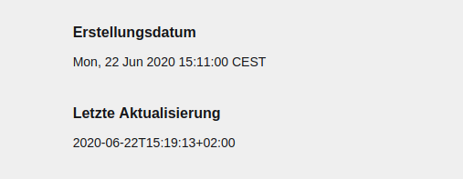

## k3-date-extended
[](https://github.com/Adspectus/k3-date-extended/releases)
[](https://github.com/Adspectus/k3-date-extended/issues)
[](https://github.com/Adspectus/k3-date-extended/blob/master/LICENSE)
[](https://getkirby.com/)


Kirby 3 plugin to provide additional date fields as epoch

## Getting Started

### Prerequisites

* Kirby 3

### Installation

You can install this plugin via one of the following methods:

1. Composer

       composer require adspectus/date-extended

2. Manual

   Clone this repository or download the current release and extract the file `index.php` into a new folder `site/plugins/date-extended` of your Kirby installation.

## Usage

This plugin uses the `page.create:after` hook to store 2 additional fields into the page, the creation and modification date/time as a Unix Epoch. With the `page.update:after` and the `page.changeTitle:after` hooks only the modification date is updated.

In addition to that, the plugin provides a field method `epoch2date` to return this epoch in a formatted string. The default format of this string is set to `D, j M Y H:i:s T`, but this can be changed on a global level in site-config with

    'adspectus.date-extended.dateFormat' => string or constant

or as a parameter to the field method.

The fieldnames can be set with

    'adspectus.date-extended.dateCreated' => 'myCreationDate',
    'adspectus.date-extended.dateModified' => 'myModificationDate',

Otherwise they default to `dateCreatedEpoch` and `dateModifiedEpoch` resp.

## Examples

After installation of this plugin, when you create and afterwards change (text or title) a page, you will have these fields in your content file:

```
----

Datecreatedepoch: 1592831460

----

Datemodifiedepoch: 1592831953

----
```

Then, you can use this in your blueprint:

```
    fields:
      date_created_info:
        type: info
        label:
          en: Creation Date
          de: Erstellungsdatum
        theme: none
        text: "{{ page.dateCreatedEpoch.epoch2date }}"
      date_modified_info:
        type: info
        label:
          en: Last Modification
          de: Letzte Aktualisierung
        theme: none
        text: "{{ page.dateModifiedEpoch.epoch2date('c') }}"
```

and in the panel it will look like this:



## License

[GNU General Public License v3.0](LICENSE)

## Acknowledgements

* [texnixe](https://forum.getkirby.com/u/texnixe/) for the basic stuff